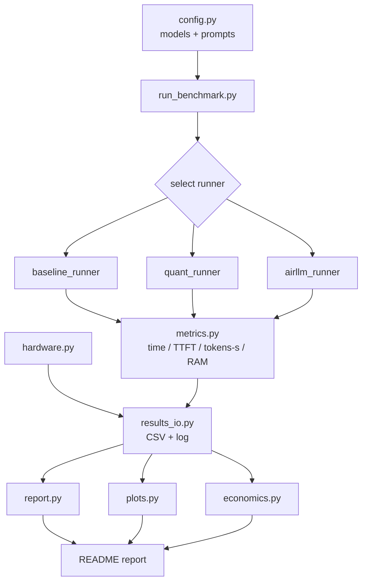
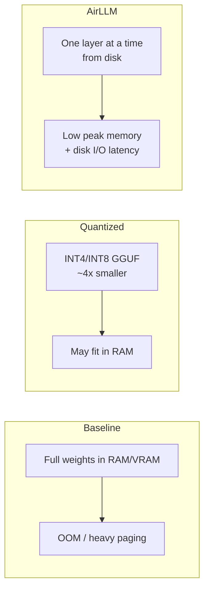

# Assignment 05 — Running a Massive LLM Locally
### AirLLM, Quantization and Performance Benchmarking

> **Course:** Orchestration of AI Agents — Lecture 08L (Local inference and training of large language models)
> **This README is the final technical report.**
> **Status:** Documentation stage complete. Source code and results are generated after running the benchmark commands (see [Planned CLI Instructions](#planned-cli-instructions)). Sections marked _⏳ to be generated_ contain **no fabricated numbers**.

---

## 1. Assignment / Research Question
**Can a massive LLM run on a low-resource laptop (8 GB RAM, ~2 GB VRAM), and which memory-aware techniques (quantization, AirLLM) make local inference feasible?**

Sub-questions:
- Where exactly does a large model fail — VRAM, RAM, or paging/swap?
- How much does **quantization** (FP16 → INT8/INT4/GGUF) change memory and tokens/sec?
- What does **AirLLM's** layer-by-layer streaming buy us, and at what latency cost?
- Is local On-Prem cheaper than Cloud GPU or API for this workload?

The goal is **not** the best text quality. The goal is to **analyze constraints, measure performance, and explain limitations** — grounded in Lecture 08L.

---

## 2. Problem Explanation
A transformer LLM must hold in memory:
1. **Weights** — parameter count × bytes-per-parameter (FP16 = 2 bytes → a 7B model ≈ 14 GB).
2. **KV cache** — grows with context length × layers × hidden size, consumed during **decode**.
3. **Activations** — transient per-forward-pass buffers.

On this machine, a 7B FP16 model (~14 GB) **cannot** fit in 8 GB RAM or ~2 GB VRAM. Loading it forces the OS into heavy **paging/swap**, making inference extremely slow or causing an out-of-memory (OOM) failure.

Two lecture techniques address this:
- **Quantization** — store weights in fewer bits (INT8, INT4). A 7B INT4 model shrinks to ~3.5 GB, which may fit in RAM for CPU inference. Formats: **GGUF** (quantized, mmap-friendly) and **SafeTensors** (safe weight container).
- **AirLLM** — load and execute **one transformer layer at a time** from disk, freeing memory between layers. Peak memory becomes ~one-layer-sized instead of whole-model-sized, at the cost of disk I/O latency.

> **This expected failure/slowness is the experiment, not a defect of the machine.**

---

## 3. Lecture-Based Method Explanation (Lecture 08L)
| Concept | How this project uses it |
|---|---|
| **CPU vs GPU** | Baseline runs on CPU; GPU (MX110, ~2 GB) is too small for most models — documented. |
| **VRAM & RAM limits** | Treated as hard ceilings; failures attributed to the specific limit hit. |
| **Hugging Face model selection** | Choose small models (gpt2, Qwen2.5-0.5B, TinyLlama-1.1B) that *can* run; a large model is used for controlled failure analysis. |
| **Ollama local inference** | Optional quantized backend via local HTTP API. |
| **Quantization** | Compare FP baseline vs INT4/INT8 GGUF memory + speed. |
| **GGUF & SafeTensors** | GGUF for quantized/mmap runs; SafeTensors as the safe HF weight format. |
| **Prefill & Decode** | TTFT measures prefill; decode tokens/sec measured separately. |
| **Latency / throughput / tokens/sec** | Core metrics collected per run. |
| **Virtual memory / paging / mmap** | Observed via RAM sampling; GGUF mmap reduces load cost. |
| **AirLLM** | Layer-by-layer streaming — run or controlled analysis. |
| **Cost: Local vs Cloud GPU vs API** | Economic analysis section. |
| **Transformer / attention / KV cache** | Explains *why* memory scales with model size and context. |

---

## 4. Hardware Profile
| Component | Spec |
|---|---|
| OS | Windows 11 Pro (10.0.26200) |
| Laptop | ASUS VivoBook 15 X540UBR |
| CPU | Intel Core i7-8550U @ 1.80 GHz |
| Cores / Threads | 4 / 8 |
| RAM | 8 GB |
| GPU 1 | Intel UHD Graphics 620 (~1 GB shared) |
| GPU 2 | NVIDIA GeForce MX110 (~2 GB VRAM) |
| Disk | SanDisk 256 GB |
| Python | 3.8.0 |
| Claude Code | 2.1.186 |

**Key implication:** ~2 GB VRAM < weights of any 7B model; 8 GB RAM is shared with the OS. This drives every design decision.

---

## 5. Planned Code Structure
All source under `src/`; **every Python file < 150 lines**; runs from the terminal.

```
src/
├── config.py              # models, prompts, run settings
├── hardware.py            # CPU/RAM/GPU/OS probe (psutil)
├── metrics.py             # timers, TTFT, tokens/sec, RAM sampler
├── results_io.py          # CSV append, logs, loaders
├── plots.py               # matplotlib charts
├── economics.py           # local vs cloud GPU vs API cost model
├── report.py              # aggregate CSV -> summary tables
├── run_benchmark.py       # CLI orchestrator (argparse subcommands)
└── runners/
    ├── base_runner.py     # runner interface + shared timing
    ├── baseline_runner.py # HF transformers CPU baseline
    ├── quant_runner.py    # GGUF/quantized (llama-cpp / Ollama)
    └── airllm_runner.py   # AirLLM run OR controlled analysis
results/                   # CSVs, PNGs, logs (generated later)
models/                    # weights (gitignored)
```
Full module descriptions are in [`plan.md`](plan.md).

---

## 6. Architecture Diagrams (Mermaid)

### Vibe Coding Lifecycle


### Benchmark Data Flow


### Memory Strategy Comparison


---

## 7. Planned CLI Instructions
```bash
# 1. Environment (Windows PowerShell)
python -m venv .venv
.venv\Scripts\activate
pip install -r requirements.txt

# 2. Pipeline
python src/run_benchmark.py hardware      # document hardware
python src/run_benchmark.py baseline      # small model, CPU
python src/run_benchmark.py quant         # quantized GGUF
python src/run_benchmark.py airllm        # AirLLM run OR analysis
python src/run_benchmark.py all --dry-run # mock end-to-end (no download)
python src/run_benchmark.py report        # summary tables
python src/run_benchmark.py plots         # PNG charts
python src/run_benchmark.py economics     # cost comparison
```

### Optional heavy dependencies (install only if hardware/run allows)
These are **not** in `requirements.txt` on purpose:
```bash
pip install torch --index-url https://download.pytorch.org/whl/cpu
pip install transformers
pip install llama-cpp-python        # GGUF quantized inference
pip install airllm                  # layer-by-layer streaming
pip install bitsandbytes            # INT8 (often GPU-only; may not work here)
# Ollama: install the desktop app separately for local quantized models.
```
> ⚠️ On Python 3.8 / ~2 GB VRAM, some heavy packages may fail to install or run. Any such failure is **recorded as a valid result** with its error reason.

---

## 8. Planned Results
_⏳ to be generated after running the benchmark commands. No numbers are invented._

### 8.1 Raw / Summary Table (template)
| Config | Model | Params | Precision | Load (s) | TTFT (s) | Tokens/s | Peak RAM (MB) | VRAM | Result | Error reason |
|---|---|---|---|---|---|---|---|---|---|---|
| baseline | _tbd_ | _tbd_ | FP32/16 | ⏳ | ⏳ | ⏳ | ⏳ | ⏳ | ⏳ | ⏳ |
| quantized | _tbd_ | _tbd_ | INT4/8 GGUF | ⏳ | ⏳ | ⏳ | ⏳ | ⏳ | ⏳ | ⏳ |
| airllm | _tbd_ | _tbd_ | layer-stream | ⏳ | ⏳ | ⏳ | ⏳ | ⏳ | ⏳ | ⏳ |
| too-big (expected fail) | _tbd_ | 7B | FP16 | ⏳ | — | — | ⏳ | OOM? | ⏳ | ⏳ |

Source files (after runs): `results/benchmark_runs.csv`, `results/summary.csv`.

### 8.2 Plots (template)
- `results/tokens_per_sec.png` — throughput per configuration ⏳
- `results/load_time.png` — load time per configuration ⏳
- `results/ram_usage.png` — peak RAM per configuration ⏳

---

## 9. Planned Discussion
_⏳ written after results exist. Will cover:_
- **Prefill vs Decode:** how TTFT (prefill) compares to steady-state decode tokens/sec.
- **Where it broke:** VRAM ceiling vs RAM ceiling vs paging/swap slowdown.
- **Quantization effect:** memory reduction and tokens/sec change (and any quality trade-off noted qualitatively).
- **AirLLM effect:** peak-memory reduction vs disk-I/O latency penalty; when it is worth it.
- **mmap / virtual memory:** how GGUF mmap changes load behavior.
- Each finding explicitly tied to a **Lecture 08L** concept.

---

## 10. Planned Economic Analysis
_⏳ computed by `economics.py` → `results/economics.csv`. Template:_

| Option | Upfront | Ongoing | Per-1M-tokens (est.) | Notes |
|---|---|---|---|---|
| Local On-Prem (this laptop) | hardware cost | electricity | ⏳ | slow but zero marginal API cost |
| Cloud GPU (rented) | none | hourly rate | ⏳ | fast, pay-per-hour, setup overhead |
| API (hosted LLM) | none | per-token | ⏳ | fastest to use, ongoing per-call cost |

Discussion of break-even (when local amortization beats cloud/API) added after computation.

---

## 11. Planned Conclusion
_⏳ written last. Will answer the research question:_ whether a massive LLM is feasible on this hardware, which technique (quantization vs AirLLM) is most practical here, and the honest limitations observed. Failures are reported as legitimate, expected outcomes.

---

## 12. AI Prompts Used
This project was built with an AI CLI coding agent (Claude Code) following Vibe Coding.

**Documentation-stage prompt (summary):**
> "Build Assignment 05 for *Orchestration of AI Agents* on running a massive LLM locally (AirLLM, quantization, benchmarking). Follow the Vibe Coding lifecycle. First create only documentation: prd.md, plan.md, todo.md, README.md, requirements.txt, .gitignore. Rules: Python code later under `src/`, results under `results/`, every Python file < 150 lines, must run from terminal, README is the final technical report, no fake results, label ungenerated results clearly. Use Lecture 08L concepts (local inference, CPU/GPU, VRAM/RAM limits, HF model selection, Ollama, quantization, GGUF/SafeTensors, prefill/decode, tokens/sec, paging/mmap, AirLLM, local vs cloud vs API cost). Given hardware: i7-8550U, 8 GB RAM, MX110 ~2 GB VRAM, Windows 11, Python 3.8."

_Implementation-stage prompts will be appended here as code is generated._

---

## 13. Vibe Coding Lifecycle Explanation
| Stage | Meaning | This project |
|---|---|---|
| **Idea** | Define the goal | Benchmark local LLM inference under tight memory limits |
| **PRD** | Requirements | [`prd.md`](prd.md) |
| **Plan** | Architecture | [`plan.md`](plan.md) — modular, files < 150 lines |
| **TODO** | Task checklist | [`todo.md`](todo.md) |
| **Verify** | Check plan before coding | line-count + dry-run + schema checks |
| **Execute** | Build & run | implement `src/`, run benchmarks, fill results |
| **Push** | Publish | commit + push to public GitHub repo |

We are currently at the boundary of **TODO → Verify**: documentation is complete; implementation of `src/` and generation of `results/` come next.

---

## 14. Repository Rules Compliance
- ✅ Python source will live in `src/`.
- ✅ Results/plots/logs/CSVs will live in `results/`.
- ✅ Every Python file will be < 150 lines.
- ✅ Runs from the terminal.
- ✅ No single huge file — modular split.
- ✅ README is the final technical report.
- ✅ No invented results — ungenerated items marked _⏳ to be generated_.
